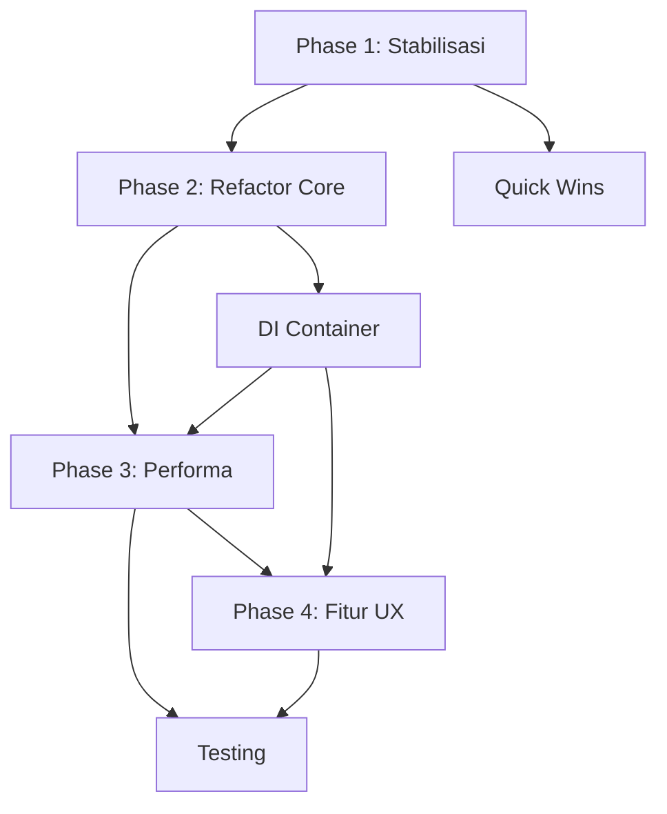

# BMachine.v2 - Structured TODO List

> **Prioritas**: 🔴 Critical (Bug/Stabilitas) | 🟠 High (Performa/Refactor) | 🟡 Medium (Fitur UX) | 🟢 Low (Nice to have)

---

## 🔴 PHASE 1: STABILISASI & BUG FIXES (Minggu 1-2)

### 1.1 Exception Handling & Logging
- [ ] **Wrap semua `catch { }` kosong** dengan proper logging (`_logger.Error()`)
  - Files: `DashboardViewModel.cs` (line 1387, 1409, 1434, 1539), `SettingsViewModel.cs`, `PixelcutViewModel.cs`
- [ ] **Tambah `ILogger` injection** ke semua ViewModel yang butuh logging
- [ ] **Buat `LoggingService`** implement `ILogger` → write ke file + debug output

### 1.2 Database Keys Constants
- [ ] **Buat `src/BMachine.Core/Constants/DbKeys.cs`** - centralisasi 50+ magic string
  - Contoh: `Trello.EditingBoardId`, `Google.SheetId`, `Settings.Color.Editing`, dll
- [ ] **Replace semua hardcoded string** di `DashboardViewModel`, `SettingsViewModel`, `PixelcutViewModel`, `GdriveViewModel`, `BatchViewModel`, `FolderLockerViewModel`

### 1.3 Race Condition Trello Sync
- [ ] **Tambah `SemaphoreSlim` / lock** di `SyncTrelloStats()` prevent overlap
- [ ] **Ganti `DispatcherTimer` 1 detik** dengan `PeriodicTimer` + proper cancellation
- [ ] **Atomic update** untuk `_lastEditingCount`, `_lastRevisionCount`, `_lastLateCount`

### 1.4 Database Connection Pooling
- [ ] **Refactor `DatabaseService`** pakai single connection / connection pool
- [ ] **Hapus `SqliteConnection.ClearAllPools()` hack** di `ImportDatabase()`
- [ ] **Tambah index** pada `KeyValueStore.Key` (sudah PK tapi verify)

### 1.5 PixelcutService Dependency Injection
- [ ] **Inject `PixelcutService` via constructor** di `PixelcutViewModel` (line 56)
- [ ] **Register di DI container** (lihat Phase 2.4)

---

## 🟠 PHASE 2: REFACTOR CORE ARCHITECTURE (Minggu 2-4)

### 2.1 Extract Services dari DashboardViewModel
| Service Baru | Logika Dipindahkan | File Target |
|--------------|-------------------|-------------|
| `TrelloSyncService` | `SyncTrelloStats()`, `GetTrelloListCount()`, notification trigger | `src/BMachine.UI/Services/TrelloSyncService.cs` |
| `ConnectivityService` | `CheckConnectivity()`, `IsOnline`/`IsSpreadsheetOnline` | `src/BMachine.UI/Services/ConnectivityService.cs` |
| `LogPanelViewModel` | `LogItems`, `ParseLog()`, `HandleDroppedLogFile()`, filter | `src/BMachine.UI/ViewModels/LogPanelViewModel.cs` |
| `ActivityFeedService` | `Activities`, `UpdateGreeting()`, `LoadAvatarImage()` | `src/BMachine.UI/Services/ActivityFeedService.cs` |
| `FloatingWidgetService` | `IsFloatingWidgetVisible`, position, broadcast | `src/BMachine.UI/Services/FloatingWidgetService.cs` |
| `NavigationSettingsService` | `LoadNavSettings()`, `SaveNavSettings()` (dipakai 2 VM) | `src/BMachine.UI/Services/NavigationSettingsService.cs` |

### 2.2 SettingsViewModel Modularization
- [ ] **Buat sub-ViewModels**:
  - `ThemeSettingsVM` - theme, colors, background, border, card, terminal
  - `TrelloSettingsVM` - API key, token, board/list picker, QC board
  - `GoogleSettingsVM` - creds path, sheet ID, range, leaderboard config
  - `ScriptManagerVM` - script order, enable/disable, filter
  - `ExtensionManagerVM` - load/toggle/delete extensions
  - `ShortcutSettingsVM` - shortcut recorder, config
  - `AppearanceSettingsVM` - nav button size, radius, font, style
- [ ] **SettingsViewModel jadi composer** - inject sub-VMs, forward commands

### 2.3 Constants & Enums Centralization
- [ ] **`DbKeys.cs`** (Phase 1.2)
- [ ] **`MessageTypes.cs`** - semua message class names
- [ ] **`WidgetSize`, `LogLevel`, `ThemeVariantType`** - sudah di SDK, verify usage

### 2.4 Proper DI Container
- [ ] **Tambah package** `Microsoft.Extensions.DependencyInjection` ke `BMachine.App`
- [ ] **Buat `ServiceCollectionExtensions.cs`** register semua:
  - `IDatabase` → `DatabaseService` (singleton)
  - `IEventBus` → `EventBus` (singleton)
  - `ILogger` → `LoggingService` (singleton)
  - `INavigationService` → `NavigationService` (singleton)
  - `INotificationService` → `NotificationService` (singleton)
  - `IActivityService` → `DatabaseService` (singleton)
  - `ILanguageService` → `LanguageService` (singleton)
  - `IProcessLogService` → `ProcessLogService` (singleton)
  - `PixelcutService` (transient)
  - `ThemeService` (singleton)
  - All ViewModels (transient)
- [ ] **Update `Program.cs`** & `MainWindowViewModel` pakai `IServiceProvider`

### 2.5 Result Pattern untuk Error Handling
- [ ] **Buat `Result<T>` record** di `BMachine.SDK`
- [ ] **Refactor service methods** return `Task<Result<T>>` instead of throwing
- [ ] **Update callers** handle `Result` pattern

---

## 🟡 PHASE 3: PERFORMA & OPTIMASI (Minggu 3-4)

### 3.1 Database Optimization
- [ ] **Connection pooling** di `DatabaseService` - single `SqliteConnection` + `SemaphoreSlim`
- [ ] **SQL WHERE clause** di `QueryAsync<T>` - jangan load all filter in-memory
- [ ] **Batch insert/update** untuk `SetAsync` multiple keys

### 3.2 UI Virtualization
- [ ] **`LogPanelSidebar.axaml`** → `VirtualizingStackPanel` + `ItemsRepeater`
- [ ] **`EditingCardListView.axaml`**, `RevisionCardListView.axaml`, `LateCardListView.axaml` → virtualization
- [ ] **`SpreadsheetView.axaml`** → virtualization untuk ribuan row

### 3.3 Lazy Loading ViewModels
- [ ] **Defer init** `PixelcutVM`, `GdriveVM`, `OutputExplorerVM` di `DashboardViewModel.InitializeChildViewModels()` sampai tab dibuka
- [ ] **Tab activation event** → init VM on first select

### 3.4 Trello Sync Parallelization
- [ ] **`Task.WhenAll`** untuk fetch 3 list paralel
- [ ] **Cache board/list metadata** reduce API calls

### 3.5 Debounce Settings Save
- [ ] **Buat `DebouncedProperty` helper** atau pakai `System.Reactive` `Throttle`
- [ ] **Apply ke semua** `partial void OnXxxChanged` yang call `_database.SetAsync()`

### 3.6 Image Loading Optimization
- [ ] **Avatar load** → copy ke `MemoryStream` avoid file lock
- [ ] **Cache `Bitmap`** di memory untuk avatar preset
- [ ] **Splash screen** → load once, reuse

---

## 🟢 PHASE 4: FITUR UX BARU (Minggu 4-7)

### 4.1 Global Search (Cmd/Ctrl+K)
- [ ] **Buat `GlobalSearchViewModel`** - index: Trello cards, Spreadsheet rows, Scripts, Settings, Logs
- [ ] **Shortcut global** via `TriggerConfig` + `IPlatformService` hook
- [ ] **UI**: Overlay mirip VS Code Command Palette / Raycast

### 4.2 Keyboard Shortcut System Lengkap
- [ ] **UI Shortcut Recorder** di Settings (sudah ada `TriggerRecordedMessage`)
- [ ] **Conflict detection** - warn jika shortcut bentrok
- [ ] **Preset schemes**: VS Code, IntelliJ, Default
- [ ] **Export/Import** shortcut config

### 4.3 Offline-First dengan Sync Queue
- [ ] **`PendingChangesQueue`** service - simpan operasi offline (Trello move, Google edit)
- [ ] **Background sync** saat `ConnectivityService.IsOnline` jadi true
- [ ] **Conflict resolution** UI (local vs remote)

### 4.4 Drag & Drop Universal
- [ ] **Trello card** → antar list (Editing ↔ Revision ↔ Late)
- [ ] **File** → Spreadsheet import (CSV/Excel)
- [ ] **Script** → reorder di Script Manager

### 4.5 Smart Notification Center
- [ ] **`NotificationCenterViewModel`** - in-app list, grouping, mark read, snooze
- [ ] **Priority**: High/Medium/Low dengan warna/icon beda
- [ ] **Sound custom** per priority
- [ ] **Persist** ke database, sync across session

### 4.6 Workspace / Project System
- [ ] **`WorkspaceService`** - simpan: tab terbuka, filter, window size/pos per project
- [ ] **Quick switcher** `Ctrl+Shift+P` → pilih workspace
- [ ] **Auto-save** on window close, auto-restore on open

### 4.7 Script Marketplace / Gallery
- [ ] **`ScriptGalleryViewModel`** - list dari GitHub/Gist/URL
- [ ] **Versioning**, rating, auto-update check
- [ ] **Dependency check** (Python version, Photoshop version, dll)
- [ ] **One-click install** ke `Scripts/Action/`

---

## 📦 PHASE 5: TECHNICAL DEBT & POLISH (Ongoing)

### 5.1 Testing
- [ ] **Buat project `BMachine.Tests`** (xUnit + Moq + Avalonia.Headless)
- [ ] **Unit test**: `DatabaseService`, `AesGcmCryptor`, `TotpService`, `TrelloSyncService`, `PixelcutService`
- [ ] **Integration test**: Plugin loading, Settings save/load, Database import/export

### 5.2 Documentation
- [ ] **README.md** update: architecture diagram, plugin development guide
- [ ] **API docs** untuk SDK (XML comments → DocFX)
- [ ] **User guide** untuk fitur utama

### 5.3 CI/CD
- [ ] **GitHub Actions**: build, test, publish Linux/Windows/macOS
- [ ] **Auto-versioning** dari git tag
- [ ] **Release notes** otomatis dari PR

### 5.4 Accessibility
- [ ] **Screen reader** support (AutomationProperties)
- [ ] **High contrast** theme
- [ ] **Keyboard navigation** semua fitur

---

## 🎯 QUICK WINS (Bisa Hari Ini - 1-2 Jam)

| Task | File | Estimasi |
|------|------|----------|
| Buat `DbKeys.cs` constants | `src/BMachine.Core/Constants/DbKeys.cs` | 30 menit |
| Wrap `catch { }` dengan logger | `DashboardViewModel.cs`, `SettingsViewModel.cs` | 1 jam |
| Extract `LoadNavSettings` ke service | `NavigationSettingsService.cs` | 45 menit |
| Add `VirtualizingStackPanel` ke LogPanel | `LogPanelSidebar.axaml` | 15 menit |
| Inject `PixelcutService` via ctor | `PixelcutViewModel.cs` | 15 menit |
| Fix duplicate `LoadWidgetColorAsync` calls | `SettingsViewModel.cs` LoadSettings() | 30 menit |

---

## 📋 DEPENDENCY GRAPH

---

## 🏷️ LABELS UNTUK TRACKING

- `bug` - Exception swallowing, race condition, data loss
- `refactor` - God class extraction, modularization
- `performance` - DB pooling, virtualization, lazy load
- `feature` - Global search, shortcuts, offline, notifications
- `tech-debt` - DI, testing, constants, result pattern
- `quick-win` - < 1 jam, high impact

---

## 📝 CATATAN IMPLEMENTASI

1. **Branch strategy**: `feature/phase-1-stabilization`, `feature/phase-2-refactor`, dll
2. **PR size**: Max 400 lines changed per PR (kecuali generated code)
3. **Code review**: Minimal 1 reviewer, CI pass required
4. **Breaking changes**: Document di `CHANGELOG.md` sebelum merge

---

*Last updated: 2026-08-15*
*Generated from architect analysis*
